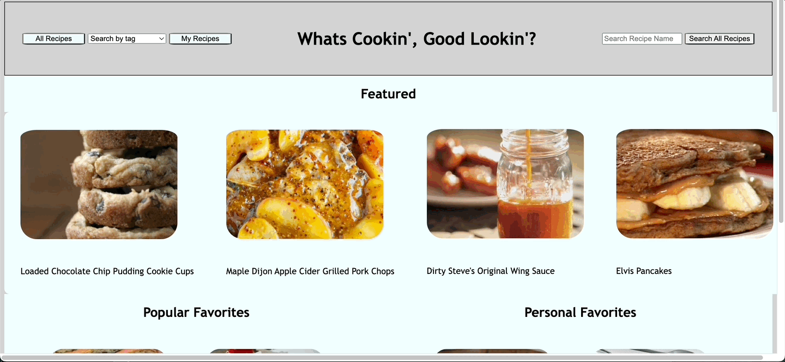

# What's Cookin!
A web app for discovering and organizing all your favorite recipes in one place.

### Introduction

What's Cookin is our second project in Mod2 of Turing School of Software and Design (it is a group project). The goal was to create a web app that uses multiple data sets including users, recipes, and ingredients. Upon load, the app logs in a random user along with their specific information including name and personal pantry items. 

[**link to page**](https://anabennett11.github.io/whats-cookin-group-project/)

### Directions and Features

On load, the user will see a home screen which includes all the recipes available represented by individual recipe cards. The site can be navigated by the nav bar on the top of the page.

**Search** By typing a recipe name or tag in their respective search box, a user will see their results after clicking the search button. Searches can include recipe names, recipe ingredients, or recipe tags.

**View Recipe Info** When a user clicks on a recipe, a new page appears revealing the full recipe info including ingredients with amounts, instructions and total costs.

**Favorite Recipes** When a user selects the "Favorites" button on a recipe card, the selected recipe will be added to the Favorite Recipes page. The user can navigate to the Favorite Recipes page by clicking on the "Favorite Recipes" button in the nav bar. The user can also search for and filter through their favorite recipes by name and tag while on the Favorite Recipe page.

**Back To Home** When a user navigates away from the home page, they can easily get back to the home page by clicking the "Go Back Home" button in the nav bar

### Gif

### Technologies Used

HTML, CSS, Vanilla JavaScript, WebPack, Mocha, Chai

### Contributors

* [Ana Bennett](https://github.com/AnaBennett11)

* [Anna Spitz](https://github.com/aspitz1)

* [Jeffrey Cook](https://github.com/JCookDev)
